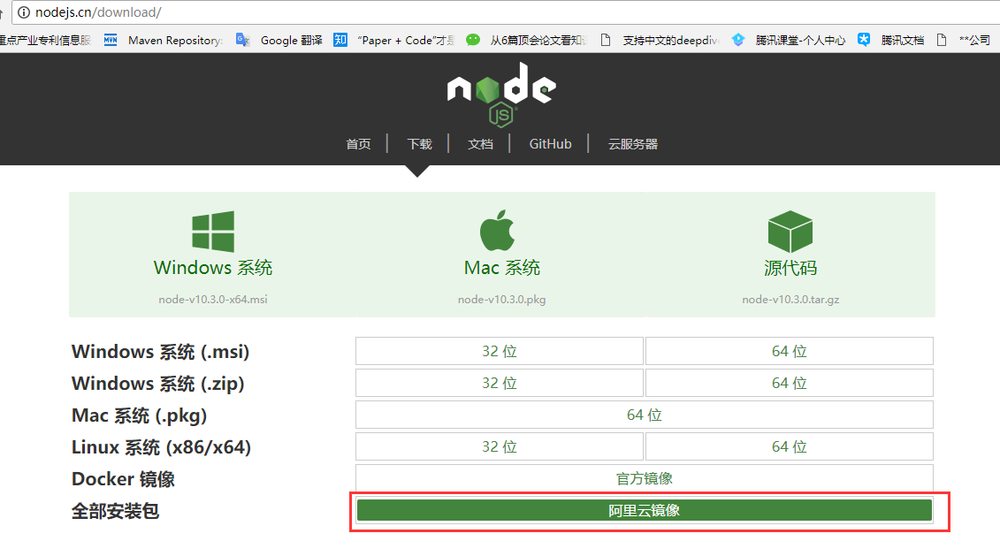
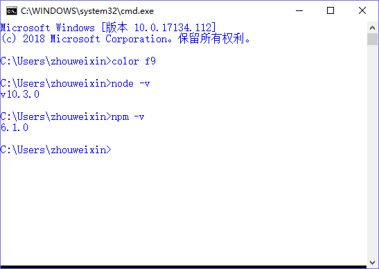
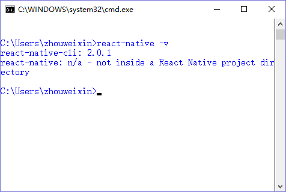
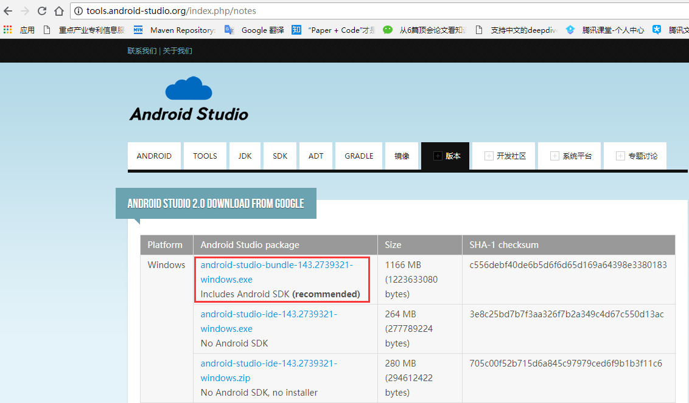
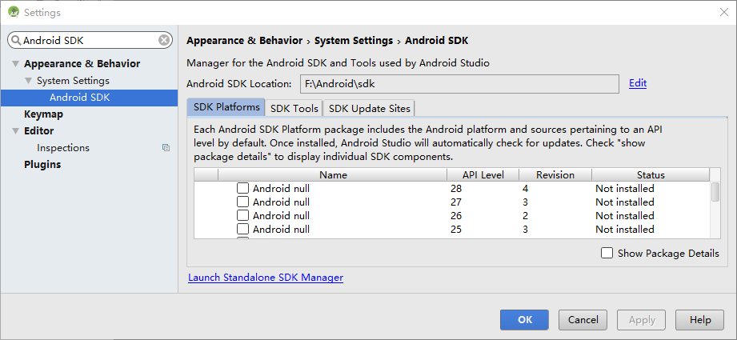
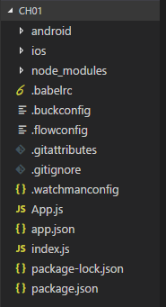
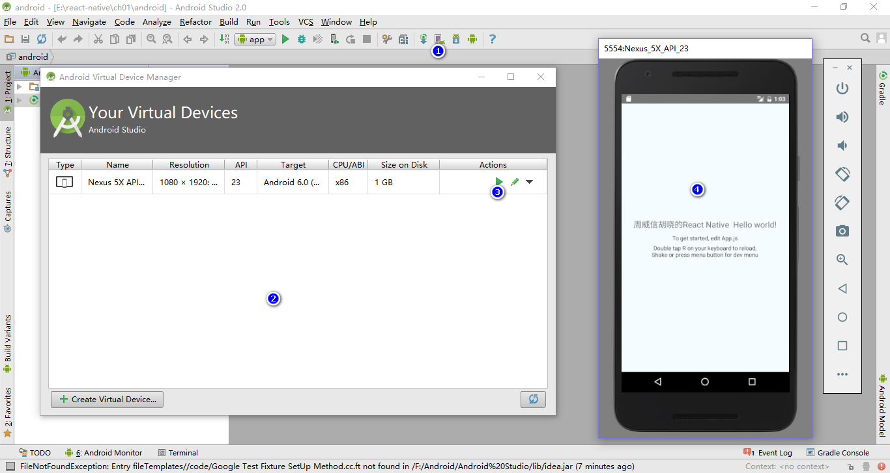
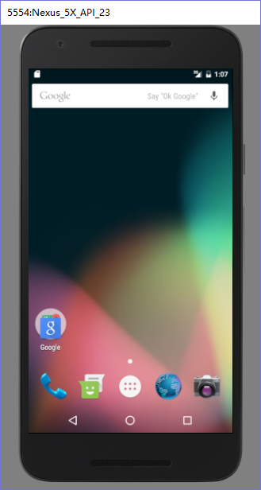
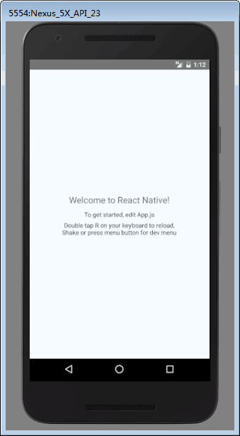
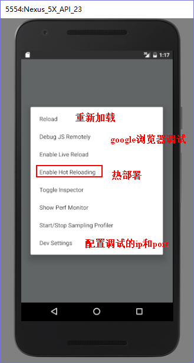

#  Reaact-native: Windows环境安装-android启动
---

## 1 安装node.js

### 1.1 下载node-v10.3.0-x64.msi

- 地址：http://nodejs.cn/download/

直接通过阿里云镜像下载（如下图）。



### 1.2 双击安装即可

### 1.3 测试是否安装成功

- 命令行(cmd)里输入如下命令,如能正确显示版本信息则表示安装成功

```
node -v
npm -v
```



## 2 安装react-native

### 2.1 命令行安装

```
npm install -g react-native-cli
```

- 如果需要安装指定版本, 可用下面的命令

```
npm install -g react-native-cli@版本号
```

### 2.2 测试是否安装成功

```
react-native -v
```



## 3 安装Android Studio

### 3.1 下载 android-studio-bundle-143.2739321-windows.exe

- 地址: http://tools.android-studio.org/index.php/notes

笔者推荐下载下面图的这个, 主要是因为包含SDK, 安装较快。并且, 安装Android Studio过程中要保证网络通畅



### 3.2 双击安装

- 中间需要选择Android studio的路径和sdk的路径, 尽量不要放在C盘(此处笔者配置在F:\Android\Android Studio和F:\Android\sdk), 直到安装完成

### 3.3 配置环境变量

1. 添加变量: ANDROID_HOME=F:\Android\sdk
2. path中添加: %ANDROID_HOME%\tools
3. path中添加: %ANDROID_HOME%\platform-tools

### 3.4 启动Android Studio

双击: F:\Android\Android Studio\bin\studio64.exe

可右键发送到桌面快捷方式

### 3.5 修改Android Studio的SDK路径

```
File -> Settings -> 搜索Android SDK -> 设置Android SDK Location 为 F:\Android\sdk
```



## 4 创建react-native应用

用如下命令, 保证网络通畅的情况下即可创建名为ch01的应用

```
react-native init ch01
```

生成的目录结构如下图



## 5 启动android应用

### 5.1 利用Android Studio创建虚拟手机

```
点击AVD Manager -> Create Vitural Device(默认创建即可) -> 点击运行 -> 手机会开机
```



### 5.2 用手机启动



- 手机状态如上图所示, 在命令行里输入如下命令, 第一次启动会比较慢

```shell
cd ch01 # 打开ch01
adb devices # 查询手机的地址
react-native run-android emulator-5554 # 用指定手机启动应用
```

- 启动结果如下图



## 6 手机操作相关技巧

1. 重新加载

```
RR
```

2. 更多功能

```
ctrl + M # 显示菜单
```



说明:

- Reload 修改代码后, 可用双击R键或者ctrl + M 选择Reload重新加载应用程序

- Dev Settings 可以设置Google浏览器调试的ip和端口, 本地的话, 改为127.0.0.1:8081

- Enable Hot Reloading 热部署, 修改代码并保存后, 应用程序会自动重新加载

